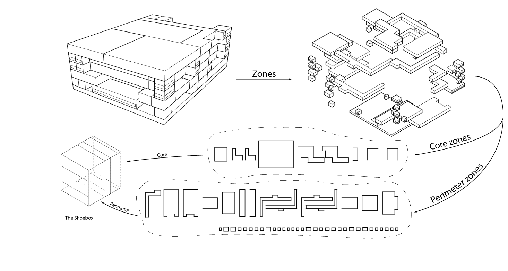

# Summary

`archetypal` is a Python package that helps handle collections of building archetypes. It
offers 3 majors functionalities:

1. Run, modify and analyze collections of EnergyPlus models in a persistent environment;
2. Convert [EnergyPlus](https://energyplus.net) IDF models to [UMI Template Files](http://web.mit.edu/sustainabledesignlab/projects/umi/index.html);
3. Convert [EnergyPlus](https://energyplus.net) IDF models to Trnsys [TrnBuild](http://www.trnsys.com/features/suite-of-tools.php) BUI Models.
 
## EnergyPlus Simulation Environment

`archetypal` is built on top of Python’s eppy [@Philip2004] and geomeppy packages to
handle parsing and modifications of EnergyPlus files. Additional functionalities where
developed such as a caching system as well as other class methods and properties that are
specific to building archetype analysis. `archetypal` lets users query EnergyPlus results
to return specific time series in a DataFrame format. For convenience, useful time series
such as the space heating, space cooling and domestic hot water profiles are accessible by
default. Users can also specify other output names and `archetypal` will append the IDF
file and rerun the simulation.

Furthermore, `archetypal` features a caching method that handles simulation results. This
is particularly useful for reproducible workflows such as the Jupyter Notebook programing
environment. Reopening a closed notebook and running a cell containing the `run` command
will use the cached simulation results instead of lunching EnergyPlus again. This offers a
drastic workflow speed gain especially when larger IDF files can take several minutes to
complete.

## EnergyPlus to UMI Template

`archetypal` aims at providing a way of creating UMI Template Files from EnergyPlus
models. The algorithm approximates the non-geometric parameters of a multi-zone EnergyPlus
model by dissecting and combining core zones and perimeter zones. The procedure is an
attempt to streamline the creation of Urban Building Energy Models (UBEM) [@Reinhart2016] based on the
"Shoeboxer" method [@Dogan2017] by accelerating the creation of building archetype
templates. This approach introduces a robust method to convert detailed multi-zone models
to archetype templates, striped of geometric properties. Consequently, `archetypal` offers
researchers and designers a way of more quickly creating UBEM studies. 

`archetypal` also aims at providing a scripting language for the modification UMI Template
Files. It essentially is a Python interface to the data format of the [UMI Template
Editor](https://github.com/MITSustainableDesignLab/basilisk).

## EnergyPlus to TRNBuild

Intermodel comparison methods are important in the field of building energy modeling
because they allow model methodologies and results to be reviewed [Judkoff1995 ].
Furthermore, some model engines include features that others don't already implement.
Since, it can be long and error-prone to create archetype buildings by hand, converting
EnergyPlus models to TrnBuild models emerged as a way of speeding both the intermodel
comparisons and the supplemental model creation. That is to say, a large repository of
prototype building models exists in the literature with a large majority developed in the
popular EnergyPlus environment [@USDOE-BuildingEnergyCodesProgram2012,
@USDOE-BuildingTechnologyOffice2018]. `archetypal ` answers a need from researchers and
building energy model specialists to create TrnBuild Models from existing EnergyPlus
models.

The latest stable release of the software can be installed via pip and full documentation
can be found at https://archetypal.readthedocs.io.

# References